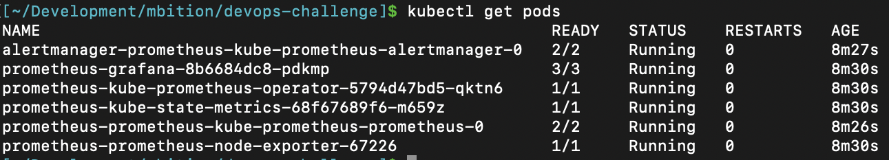
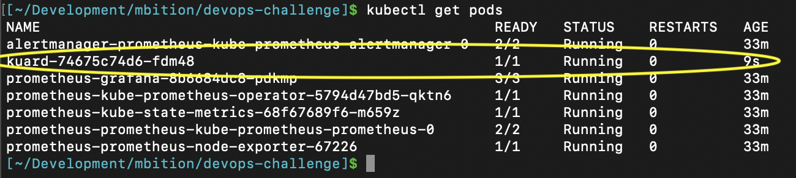
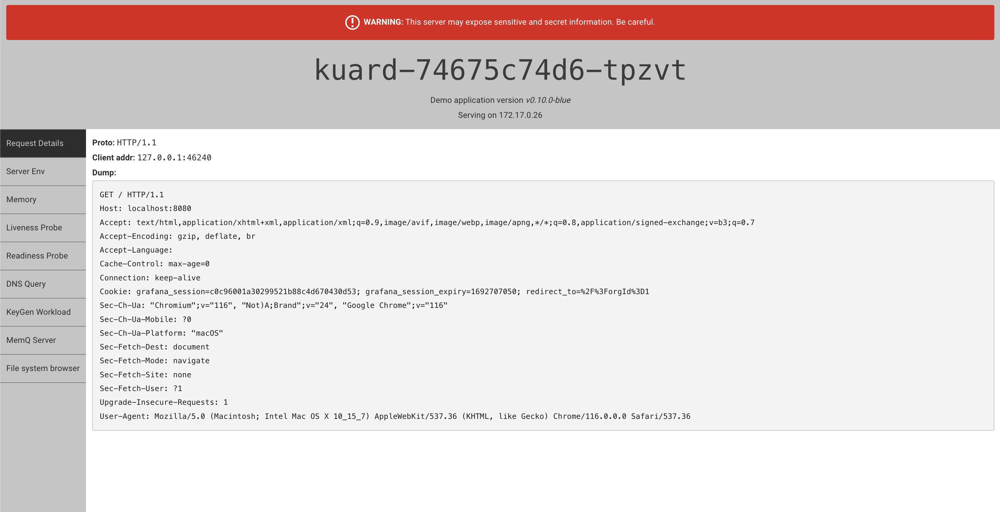
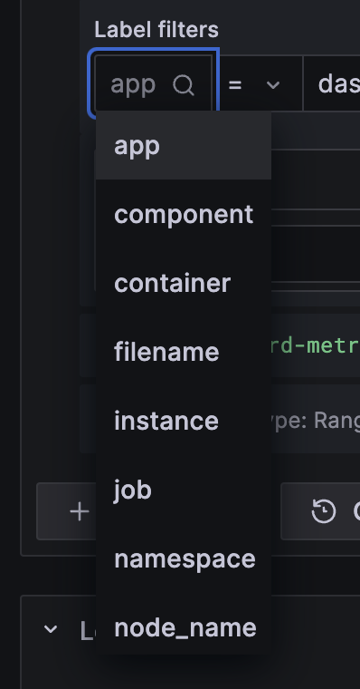
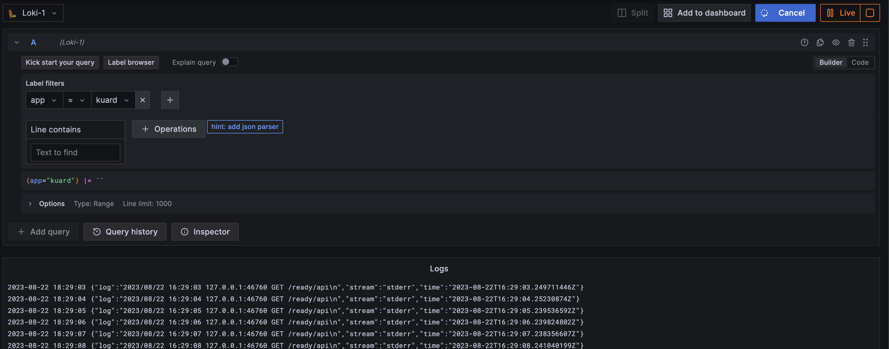

- [1. Intro](#1-intro)
  - [Pre-requisites](#pre-requisites)
  - [On grafana/prometheus](#on-grafanaprometheus)
- [2. Getting up and running](#2-getting-up-and-running)
  - [Steps to start the monitoring apps](#steps-to-start-the-monitoring-apps)
  - [Steps to start the demo app](#steps-to-start-the-demo-app)
- [3. DevOps Challenge - Questions](#3-devops-challenge---questions)
- [4. Extra Questions](#4-extra-questions)

## 1. Intro
### Pre-requisites

- minikube or an alternate local kubernetes cluster
- have kubectl configured to connect to this cluster and the default namespace
- have helm installed (i.e `brew install helm`)

### On grafana/prometheus

- I will be using the the chart kube-prometheus-stack from prometheus's helm charts. Its a collection of Kubernetes manifests,  dashboards, and  combined with documentation and scripts to provide easy to operate end-to-end Kubernetes cluster monitoring with Prometheus using the Prometheus Operator.

## 2. Getting up and running

### Steps to start the monitoring apps

1. Install kube-prometheus-stack

    ```
    helm install prometheus grafana-charts/charts/kube-prometheus-stack 
    ```
    

2. Confirm pods are running by running `kubectl get pods`

    You should be seeing something similar to this:

  


3. To Login to grafana we must first expose the port 3000 using the following command 

    ```
    kubectl port-forward prometheus-grafana-8b6684dc8-pdkmp 3000:3000
    ```

    Now u can visit [localhost:3000](localhost:3000) and use the following credentials to login:

    - username: admin
    - password: prom-operator

4. Confirm we have prometheus and alertmanager configured by visiting `Connections > Data sources`


### Steps to start the demo app

1. Install kuard-chart

```
helm install kuard-release kuard-chart    
```

2. Confirm kuard pod is running by executing `kubectl get pods`



3. Expose the pod running kuad with the following command:

```
kubectl port-forward kuard-74675c74d6-fdm48 8080:8080
```

visiting [localhost:8080](localhost:8080) shoudl show you the following screen:




## 3. DevOps Challenge - Questions

1. **Logging solution in Kubernetes** - Loki is grafana's solution for centralisation of logs. 

    To install loki, the best approach would be to install the loki-stack from grafana's helm charts

    ```
    helm install loki grafana/loki-stack --set "grafana.enabled=false,prometheus.enabled=false"    
    ```

    Notice how we don't need to enable grafana nor prometheus as its already installed via the kube-prometheus-stack (from the monitoring stack).

    Loki allows you to fine tune your selection of logs. From a specific node, namespace, container or even a specific pod
    
    

    An example of the Kuard logs would look something like the following:

    

2. **Kubernetes board resources ensure application can cope with a high number of requests.**

    Autoscaling should be enabled in the values.yaml, if the CPU threshold is reached (80%) then it will fire up a new pod allowing the app to cope with a higher number of requests

3. **Detect templating error before a deployment**

    In the CI/CD pipeline, before executing the deployment we would have a step to run the `helm lint` command in each of the charts    

4. **Resetting failed deployment**
    
    To rollback to the previous release

    ```
    helm rollback
    ```

    To rollback to the a specific release

    ```
    helm rollback <RELEASE>
    ```

5. **What metrics does the demo app offer**

   demo app uses the go_lang client prometheus, so we have typical go related stats:
   - go allocatable memory
   - go used memory
   - etc...

6. **Which CI/CD tool would be my tool of choice**

    Either Github Actions or Gitlab CI/CD (depends where the repo is hosted)

## 4. Extra Questions 